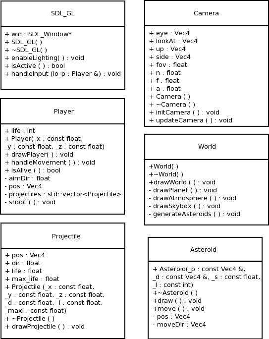
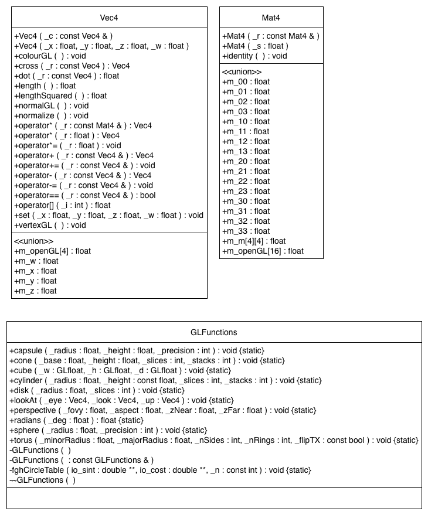

# PPP_Assignment2
PPP Assignment 2 Super Stardust HD Prototyping 
Super Stardust © by Housemarque 
https://github.com/v0q/PPP_Assignment2

# Installation instructions:

qmake 
make clean 
make 
./super_stardust 
 
If the ship is moving sideways (rotated 90 degrees), 
Remove the #ifdef LINUX ... #endif (leave what's in  
DARWIN defs in the code). This was a bit of a hacky 
solution where on the uni machines the models and texture 
coordinates were rotated 90 degrees and I wasn't able to 
figure out what was wrong within the time limit. 
 
The places where this hacky solution is used are: 
Player.cpp 	- lines: 	56	 - 63 
Player.cpp 	- lines: 	118	 - 122 
World.cpp 	- lines:	 43	 - 50 

# Instructions:

Moving: 
Game Controller

Left stick to move 
Right stick to aim and fire

Keyboard

W 	- up 
S 	-	down 
A 	- left 
D 	- right 
 
SPACE 	- shoot 
 
LEFT ARROW 		- turn aim ccw 
RIGHT ARROW 	- turn aim cw

# Initial design

